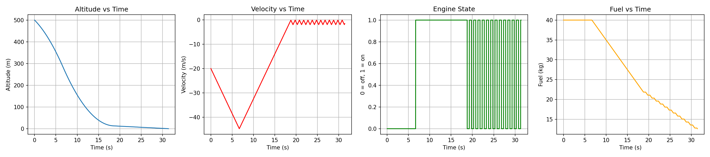
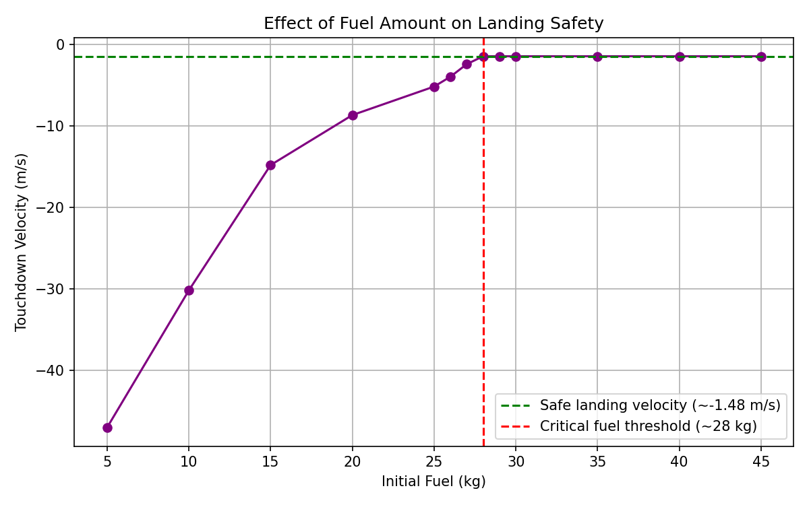
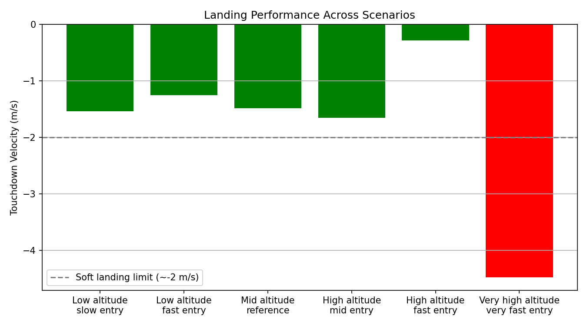

# Mars Landing Simulation — Suicide Burn Guidance

A physics-based simulation of a controlled Mars landing using the
**suicide burn** technique — the same descent strategy used by real
Mars and Moon landers. The vehicle free-falls under gravity for as
long as possible, then ignites its engine at the latest safe moment
to bring its velocity to (near) zero exactly at touchdown.

> Turkish version: [`README.tr.md`](README.tr.md)

## Why "suicide burn"?

Carrying enough fuel to decelerate throughout the entire descent is
expensive. Suicide burn minimizes fuel use by delaying
ignition as long as physically possible — but this leaves almost no
margin for error, which makes it a genuinely interesting control
problem to simulate.

## Physics model

- **Environment:** Mars gravity, `g = 3.71 m/s²` (~38% of Earth's).
- **Engine:** fixed maximum deceleration, `a_max = 7.4 m/s²` (2× gravity).
- **Integration:** semi-implicit Euler, `dt = 0.01 s`.
- **Ignition rule:** the engine fires once the vehicle's altitude drops
  to its physical stopping distance, `v² / (2·(a_max − g))`, scaled by
  a small safety margin (5%) to compensate for discretization lag.
- **Engine on/off control:** a hysteresis band (`-0.3` to `-0.1 m/s`) with a
  minimum on/off duration (`0.5 s`) prevents the engine from switching
  unrealistically fast — a real valve/engine cannot toggle every
  simulation step.
- **Fuel:** the engine consumes fuel at a fixed rate while running; if
  fuel runs out mid-burn, the engine is forced off and the vehicle
  returns to free fall.

## Results

### 1. Reference descent (500 m, −20 m/s, 40 kg fuel)



```
[Reference] Touchdown velocity: -1.48 m/s | Duration: 31.43 s | Remaining fuel: 12.61 kg
```

The vehicle free-falls, ignites its engine near the critical stopping
point, and settles into a controlled final approach — touching down
at **−1.48 m/s** with fuel to spare.

### 2. Fuel stress test — finding the critical threshold



```
Fuel=5 kg  -> Touchdown velocity=-47.00 m/s, Remaining fuel=0.00 kg
Fuel=10 kg -> Touchdown velocity=-30.19 m/s, Remaining fuel=0.00 kg
Fuel=15 kg -> Touchdown velocity=-14.82 m/s, Remaining fuel=0.00 kg
Fuel=20 kg -> Touchdown velocity=-8.69 m/s,  Remaining fuel=0.00 kg
Fuel=25 kg -> Touchdown velocity=-5.20 m/s,  Remaining fuel=0.00 kg
Fuel=26 kg -> Touchdown velocity=-3.99 m/s,  Remaining fuel=0.00 kg
Fuel=27 kg -> Touchdown velocity=-2.44 m/s,  Remaining fuel=0.00 kg
Fuel=28 kg -> Touchdown velocity=-1.48 m/s,  Remaining fuel=0.61 kg
Fuel=29 kg -> Touchdown velocity=-1.48 m/s,  Remaining fuel=1.61 kg
Fuel=30 kg -> Touchdown velocity=-1.48 m/s,  Remaining fuel=2.61 kg
Fuel=35 kg -> Touchdown velocity=-1.48 m/s,  Remaining fuel=7.61 kg
Fuel=40 kg -> Touchdown velocity=-1.48 m/s,  Remaining fuel=12.61 kg
Fuel=45 kg -> Touchdown velocity=-1.48 m/s,  Remaining fuel=17.61 kg
```

Running the same descent with initial fuel from 5 kg to 45 kg reveals
a sharp threshold: below **~28 kg**, the vehicle runs out of fuel
mid-burn and crashes (touchdown velocities worsening rapidly, up to
−47 m/s at 5 kg). At and above 28 kg, the outcome saturates at a
constant, safe −1.48 m/s. This is the minimum fuel budget this
guidance profile needs for a safe landing.

### 3. Scenario stress test — does the controller generalize?



```
Low altitude slow entry             -> Touchdown velocity=-1.54 m/s, Remaining fuel=30.90 kg
Low altitude fast entry             -> Touchdown velocity=-1.26 m/s, Remaining fuel=27.06 kg
Mid altitude reference              -> Touchdown velocity=-1.48 m/s, Remaining fuel=22.61 kg
High altitude mid entry             -> Touchdown velocity=-1.65 m/s, Remaining fuel=12.83 kg
High altitude fast entry            -> Touchdown velocity=-0.28 m/s, Remaining fuel=7.11 kg
Very high altitude very fast entry  -> Touchdown velocity=-4.48 m/s, Remaining fuel=0.00 kg
```

The same controller was tested across six different entry conditions
(altitude 300–1000 m, speed 10–50 m/s, 50 kg fuel). Five of six scenarios
land safely (under ~2 m/s), showing the control logic isn't tuned to
one specific case. The most extreme scenario (1000 m, −50 m/s) runs
out of fuel and lands hard — a reminder that more aggressive entries
require proportionally more propellant.

## Engineering notes / known limitations

- The controller is **open-loop at ignition** (a single stopping-distance
  calculation) and only corrects afterward via the hysteresis band.
  Real landers use continuous closed-loop guidance for exactly this
  reason — open-loop timing is highly sensitive near the critical point.
- The minimum burn duration (0.5 s) is a simplified stand-in for real
  valve/engine response limits; it trades off some landing precision
  for physical realism (a deliberate, documented trade-off).
- Semi-implicit Euler integration is simple and fast but not as
  accurate as higher-order methods (e.g. RK4) for very large `dt`.

## Running it

```bash
pip install matplotlib
python mars_landing_simulation.py
```

Each of the three stages (reference descent, fuel stress test, scenario
stress test) prints its results to the console and opens a plot window.

## Author

Muratcan Turğay — Electrical and Electronics Engineering student,
Van Yüzüncü Yıl University. [GitHub](https://github.com/muratcanturgay)
