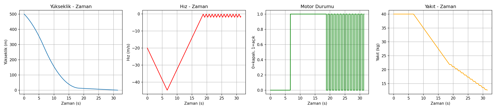
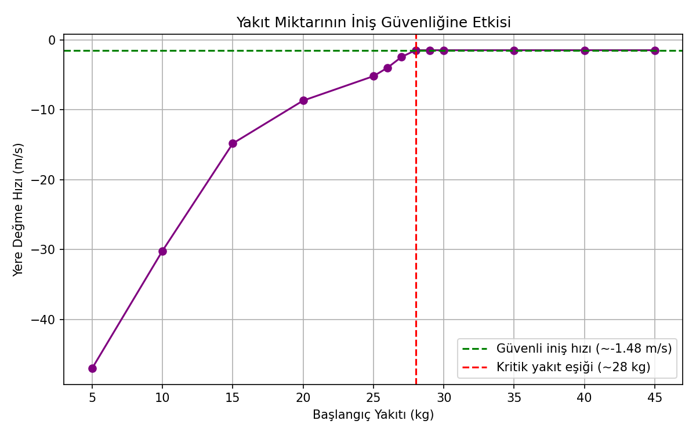
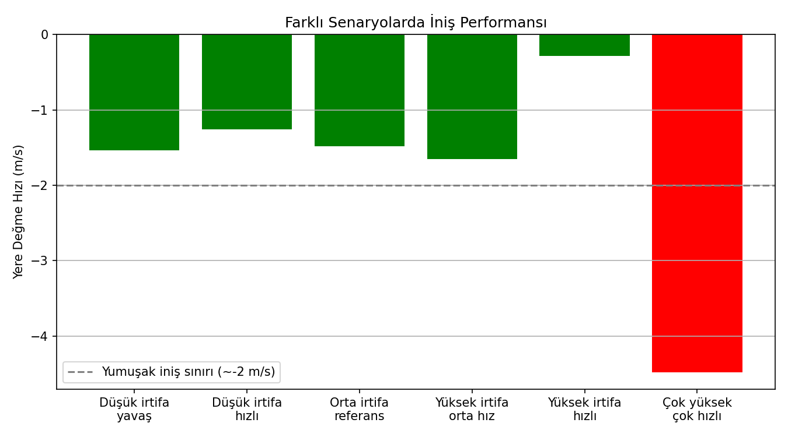

# Mars İniş Simülasyonu — Suicide Burn (İntihar Yanması) Kılavuzlama

Gerçek Mars ve Ay iniş araçlarının kullandığı **suicide burn** (intihar
yanması) tekniğiyle kontrollü bir Mars inişini simüle eden, fizik
tabanlı bir proje. Araç, yerçekimiyle olabildiğince uzun süre serbest
düşüşte kalır, sonra tam yere değeceği anda hızını (neredeyse) sıfıra
indirmek için motorunu en son güvenli anda ateşler.

> İngilizce versiyon: [`README.md`](README.md)

## Neden "suicide burn"?

Tüm iniş boyunca sürekli frenleme yapacak kadar yakıt taşımak
pahalıdır. Suicide burn, motoru fiziksel olarak mümkün olan en son ana
kadar erteleyerek yakıt tüketimini en aza indirir — ama bu, hataya
neredeyse hiç pay bırakmaz, bu da onu simüle etmek için gerçekten
ilginç bir kontrol problemi haline getirir.

## Fizik modeli

- **Ortam:** Mars yerçekimi, `g = 3.71 m/s²` (Dünya'nın ~%38'i).
- **Motor:** sabit maksimum frenleme ivmesi, `a_max = 7.4 m/s²` (yerçekiminin 2 katı).
- **İntegrasyon:** yarı-örtük Euler, `dt = 0.01 s`.
- **Ateşleme kuralı:** araç, yüksekliği `v² / (2·(a_max − g))` formülüyle
  hesaplanan duracak mesafeye indiğinde motor ateşleniyor; ayrık zaman
  adımlarından kaynaklanan gecikmeyi telafi etmek için bu mesafeye
  küçük bir güvenlik marjı (%5) ekleniyor.
- **Motor açma/kapama kontrolü:** `-0.3` ile `-0.1 m/s` arası bir histerezis bandı,
  minimum açık/kapalı kalma süresiyle (`0.5 s`) birlikte, motorun
  gerçekçi olmayan hızda açılıp kapanmasını önlüyor — gerçek bir
  valf/motor her simülasyon adımında anahtarlanamaz.
- **Yakıt:** motor çalışırken sabit bir hızda yakıt tüketiyor; yakıt
  yanma sırasında biterse motor zorla kapanıyor, araç tekrar serbest
  düşüşe geçiyor.

## Sonuçlar

### 1. Referans iniş (500 m, −20 m/s, 40 kg yakıt)



```
[Referans] Değme hızı: -1.48 m/s | Süre: 31.43 s | Kalan yakıt: 12.61 kg
```

Araç serbest düşer, kritik duracak mesafeye yakın bir noktada motorunu
ateşler, kontrollü bir son yaklaşmaya geçer — **−1.48 m/s** ile, elinde
hâlâ yakıt kalmış şekilde yere değer.

### 2. Yakıt stres testi — kritik eşiği bulmak



```
Yakıt=5 kg  -> Değme hızı=-47.00 m/s, Kalan yakıt=0.00 kg
Yakıt=10 kg -> Değme hızı=-30.19 m/s, Kalan yakıt=0.00 kg
Yakıt=15 kg -> Değme hızı=-14.82 m/s, Kalan yakıt=0.00 kg
Yakıt=20 kg -> Değme hızı=-8.69 m/s,  Kalan yakıt=0.00 kg
Yakıt=25 kg -> Değme hızı=-5.20 m/s,  Kalan yakıt=0.00 kg
Yakıt=26 kg -> Değme hızı=-3.99 m/s,  Kalan yakıt=0.00 kg
Yakıt=27 kg -> Değme hızı=-2.44 m/s,  Kalan yakıt=0.00 kg
Yakıt=28 kg -> Değme hızı=-1.48 m/s,  Kalan yakıt=0.61 kg
Yakıt=29 kg -> Değme hızı=-1.48 m/s,  Kalan yakıt=1.61 kg
Yakıt=30 kg -> Değme hızı=-1.48 m/s,  Kalan yakıt=2.61 kg
Yakıt=35 kg -> Değme hızı=-1.48 m/s,  Kalan yakıt=7.61 kg
Yakıt=40 kg -> Değme hızı=-1.48 m/s,  Kalan yakıt=12.61 kg
Yakıt=45 kg -> Değme hızı=-1.48 m/s,  Kalan yakıt=17.61 kg
```

Aynı iniş, 5 kg'dan 45 kg'a kadar farklı başlangıç yakıtlarıyla
çalıştırıldığında net bir eşik ortaya çıkıyor: **~28 kg'ın altında**,
araç yanma sırasında yakıtı tüketip çarpıyor (yere değme hızları hızla
kötüleşiyor, 5 kg'da −47 m/s'ye kadar). 28 kg ve üzerinde sonuç sabit,
güvenli bir değere (−1.48 m/s) oturuyor. Bu, kılavuzlama profilinin
güvenli bir iniş için ihtiyaç duyduğu minimum yakıt bütçesi.

### 3. Senaryo stres testi — kontrolcü genelleyebiliyor mu?



```
Düşük irtifa yavaş           -> Değme hızı=-1.54 m/s, Kalan yakıt=30.90 kg
Düşük irtifa hızlı           -> Değme hızı=-1.26 m/s, Kalan yakıt=27.06 kg
Orta irtifa referans         -> Değme hızı=-1.48 m/s, Kalan yakıt=22.61 kg
Yüksek irtifa orta hız       -> Değme hızı=-1.65 m/s, Kalan yakıt=12.83 kg
Yüksek irtifa hızlı          -> Değme hızı=-0.28 m/s, Kalan yakıt=7.11 kg
Çok yüksek çok hızlı         -> Değme hızı=-4.48 m/s, Kalan yakıt=0.00 kg
```

Aynı kontrolcü, altı farklı giriş koşulunda (300–1000 m irtifa,
10–50 m/s hız, 50 kg yakıt) test edildi. Altı senaryodan beşi güvenli
iniyor (~2 m/s altında), bu da kontrol mantığının tek bir senaryoya
göre ayarlanmadığını gösteriyor. En agresif senaryo (1000 m, −50 m/s)
ise yakıtı tüketip sert iniyor — daha agresif girişlerin orantılı
olarak daha fazla yakıt gerektirdiğinin bir hatırlatıcısı.

## Mühendislik notları / bilinen sınırlamalar

- Kontrolcü **ateşleme anında açık döngü** çalışıyor (tek seferlik bir
  duracak-mesafe hesabı), sonrasını sadece histerezis bandıyla
  düzeltiyor. Gerçek iniş araçları tam da bu yüzden sürekli kapalı
  döngü kılavuzlama kullanır — açık döngü zamanlama, kritik noktaya
  çok duyarlıdır.
- Minimum yanma süresi (0.5 s), gerçek valf/motor tepki sınırlarının
  basitleştirilmiş bir temsilidir; bu, iniş hassasiyetinden fiziksel
  gerçekçilik lehine bilinçli ve belgelenmiş bir ödünleşimdir.
- Yarı-örtük Euler integrasyonu basit ve hızlıdır, ama çok büyük `dt`
  değerlerinde daha yüksek dereceli yöntemler (örn. RK4) kadar hassas
  değildir.

## Çalıştırma

```bash
pip install matplotlib
python mars_inis_simulasyonu.py
```

Üç aşamanın (referans iniş, yakıt stres testi, senaryo stres testi)
her biri sonuçlarını konsola yazdırır ve bir grafik penceresi açar.

## Yazar

Muratcan Turğay — Elektrik-Elektronik Mühendisliği öğrencisi,
Van Yüzüncü Yıl Üniversitesi. [GitHub](https://github.com/muratcanturgay)
